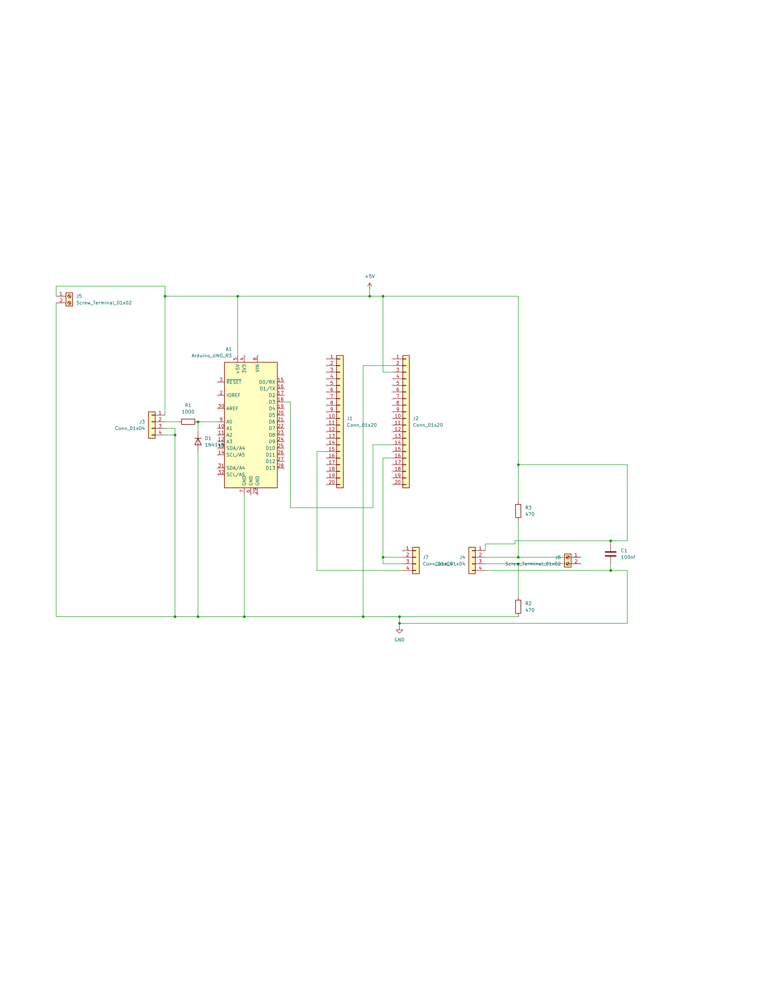
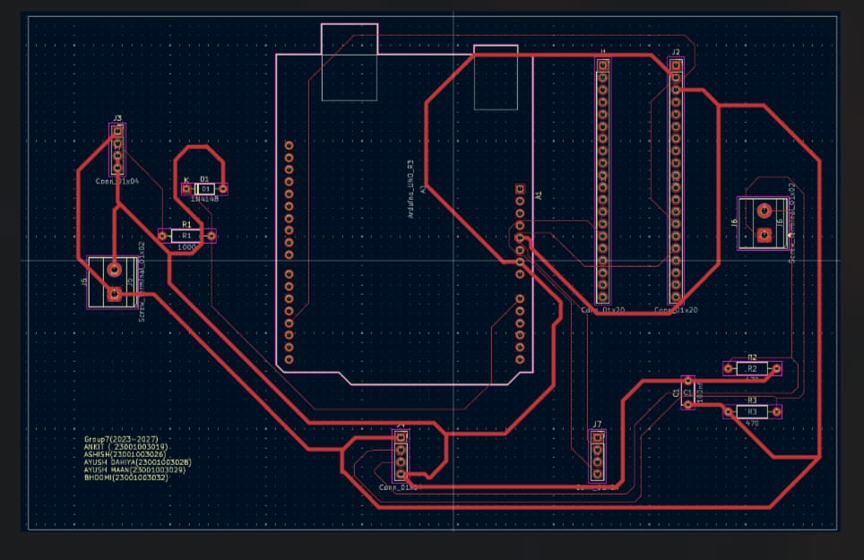

# Power Quality Monitoring System for DISCOMs

   

## 📌 Overview
A low-cost, embedded diagnostic node designed for electricity distribution networks (DISCOMs). This system is engineered to detect sub-threshold power quality anomalies that are typically invisible to conventional protection devices. 

The hardware acts as a unified motherboard, integrating microcontrollers, analog voltage sensing, and industrial RS-485 communication into a single robust node.

## 🔌 Hardware Architecture
The custom PCB functions as a docking station utilizing pre-built modules and discrete through-hole components:
*   **Microcontrollers:** Arduino Uno & STM32 Blue Pill
*   **Voltage Sensing:** ZMPT101B AC voltage transformer module
*   **Communication:** MAX485 (TTL-to-RS485 transceiver) for node-level fault reporting
*   **Safety Infrastructure:** 220V AC mains are wired directly into the ZMPT module terminals, keeping high-voltage traces entirely isolated from the custom 5V logic board.

## 🛠️ PCB Design & Fabrication
Designed entirely in **KiCad**, the board layout was heavily optimized for DIY in-house manufacturing.
*   **Clearances & Traces:** Passed stringent DRC with 0.2mm minimum clearance. Main 5V and GND power rails are thickened (0.8mm) to prevent voltage drops across the docked modules.
*   **Routing Logic:** Verified intermediate node routing (including daisy-chained parallel capacitors) with 45-degree smoothed traces to prevent acid traps.
*   **Fabrication Method:** Specifically routed to support the **toner transfer etching** method on a blank copper clad board. A 1:1 scale mirrored PDF and standard Gerber `.zip` are provided in the `/fabrication` directory.

## 🖼️ Board Previews

# 💻 Firmware: Power Quality Monitoring Node

⚠️ **Status: Work In Progress (Fine-Tuning Phase)**

This directory contains the source code for the Arduino Uno and STM32 microcontrollers. 

### Current Development Focus
The baseline hardware communication is established, and we are actively calibrating the embedded signal processing algorithms. 
Current tasks include:
* Fine-tuning the ZMPT101B analog-to-digital (ADC) sampling windows.
* Implementing isolation and classification logic for 4 distinct power fault types.
* Formatting the RS-485 serial packet structure for reliable data transmission to DISCOMs.

Code will be updated regularly as the fault classification algorithms are finalized.

## 👥 Team & Credits
This system is being developed as an undergraduate academic group project by ECE Group 7 (2023–2027) under the supervision of Dr. Prachi Choudhary[cite: 8].

*   **Ankit** (23001003019) – Hardware Architecture & Lead PCB Design[cite: 3]
*   **Ashish** (23001003026)[cite: 3]
*   **Ayush Dahiya** (23001003028)[cite: 3]
*   **Ayush Maan** (23001003029)[cite: 3]
*   **Bhoomi** (23001003032)[cite: 3]

---
*Note: This repository contains the complete KiCad project files (`.kicad_pro`, `.kicad_sch`, `.kicad_pcb`), manufacturing drill/Gerber files, and firmware source code.*
